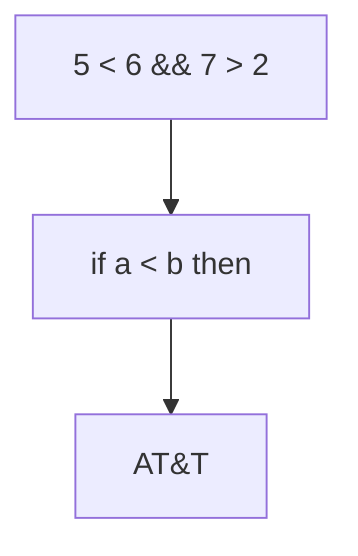
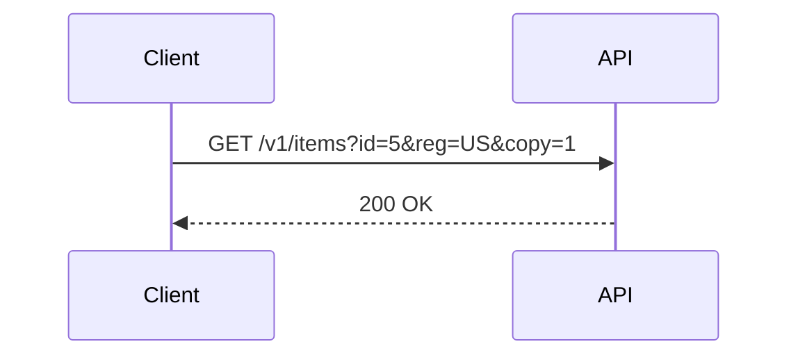

# Parity with the PDF path

Two diagrams, written the two ways the PDF renderer accepts, plus labels that
are easy to mangle.

## Labels containing markup characters

With `htmlLabels:false`, mermaid escapes these once for HTML and then inserts
the result as SVG text, escaping them twice. The reader ends up looking at
`&lt;` instead of `<`.

Decoding one layer too many is the opposite failure, so `AT&amp;T` is here as
well: mermaid's own semantics display that as `AT&T`, and the PDF path does, so
the exported image has to agree.

## A label that merely looks like markup

The opposite trap. `sequenceDiagram` puts its label into the SVG verbatim, so
undoing "an escape" here destroys text rather than restoring it: a textarea
resolves the legacy semicolon-less references, and this URL's `&reg=` and
`&copy=` query parameters would silently become `®=` and `©=`.

## A diagram written as raw HTML

The PDF path renders any `.mermaid` element, not only fenced blocks, so this
one counts too.

flowchart LR
    RawDiv --> AlsoExported

