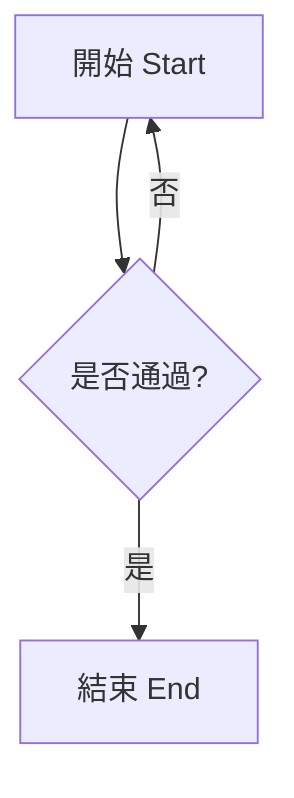
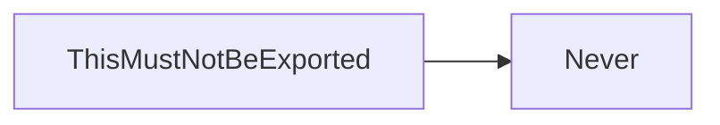

# 圖表擷取測試

This fixture exists to pin down WHICH blocks `md2pdf mermaid` exports. It holds
exactly three real diagrams, written three different ways, plus one that only
looks like a diagram. Everything else on the page must be ignored.

## 1. A backtick fence, with CJK labels

The plain case, and the one that proves labels survive as real text.



## 2. A tilde fence

A regex looking for ```` ```mermaid ```` misses this one entirely.

~~~mermaid
sequenceDiagram
    使用者->>工具: 轉換文件
    工具-->>使用者: 圖片檔
~~~

## 3. A fence nested inside a list item

Indented under a list, so it is also invisible to a line-anchored regex.

1. First, describe the state machine:

   ```mermaid
   stateDiagram-v2
       [*] --> Idle
       Idle --> Working
       Working --> [*]
   ```

2. Then ship it.

## Not a diagram: a fence quoted inside a wider fence

This is documentation ABOUT mermaid, not a diagram. A regex counts it; a real
markdown parser does not, because the outer four-backtick fence owns it.

````

````

## Not a diagram: prose, a table and a formula

None of this may reach the output directory.

| Item | Status |
| :--- | :--- |
| Diagrams | 3 |
| Everything else | skipped |

$$E = mc^2$$

- [x] ignored
- [ ] also ignored
