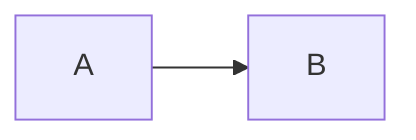

# Raw HTML in Markdown

Markdown lets a document drop into HTML at any point, and documents do.

## Contents

- [Side by side](#side-by-side)
- [Collapsed detail](#collapsed-detail)

## Side by side

<table>
<tr>
<td align="center" width="50%"><b>Left</b></td>
<td align="center" width="50%"><b>Right</b></td>
</tr>
<tr>
<td valign="middle"></td>
<td valign="bottom"></td>
</tr>
</table>

A plain markdown image resolves the same way: 

## Collapsed detail

<details>
<summary>Opened for print</summary>

This paragraph only exists in the PDF if `details` is forced open.

</details>

## Alignment in a pipe table

| Left | Centre | Right |
|:-----|:------:|------:|
| a    |   b    |     c |

## Talking about HTML

To stop a page loading, delete the `<script>` element:

```html
<script src="app.js"></script>
```

A fenced sample is not a claim that the document contains an image:

```html

```

## Quoting markup rather than containing it

A README that explains fenced blocks has to nest them, and none of the
following is a claim that this document contains a diagram, a formula or an
image:

````markdown


Display math is written $$E = mc^2$$ and an image ``.
````

<!--  is not printed either -->

## Things that only go wrong on paper

A line too long for the column must wrap rather than run off the sheet:

```
SomeVeryLongIdentifier.thatKeepsGoing.andGoing.andGoing.andGoing.andGoing.andGoing.andGoing.andShouldNotBeSilentlyClippedWhenPrinted()
```

A badge keeps the height it asked for: 

An image far below the fold still has to load, `loading` or not:

<div style="height:1400px"></div>


Prose comparing things is not a highlight: if (a == b) and (c == d) then stop.
But ==this really is one==.

## Footnotes

The renderer has to resolve these itself[^why], twice if need be[^why], and a
character class like [^a-z] must be left alone.

[^why]: marked reads `[^1]: text` as a link reference definition, so the note
    would be swallowed whole.

    A second paragraph, indented, stays with the note.

[^unused]: Nothing refers to this one, so it is dropped -- as on GitHub.
