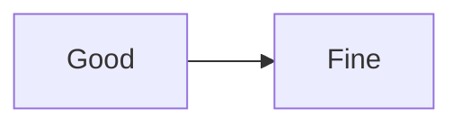

# One broken diagram, then a good one

The BROKEN one is first on purpose. Exporting must refuse both by default, and
under --no-verify must export the survivor as `-02`, keeping its position in
the document rather than renumbering it to `-01`. With the good diagram first,
that assertion would hold whether or not survivors are renumbered, and would
prove nothing.

```mermaid
flowchart LR
    A[ --> B{{{ not valid mermaid
```


