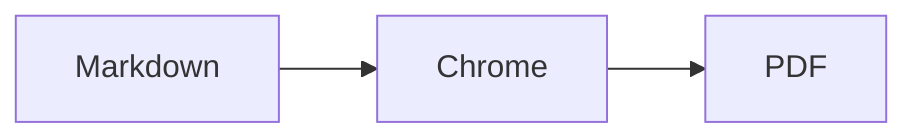
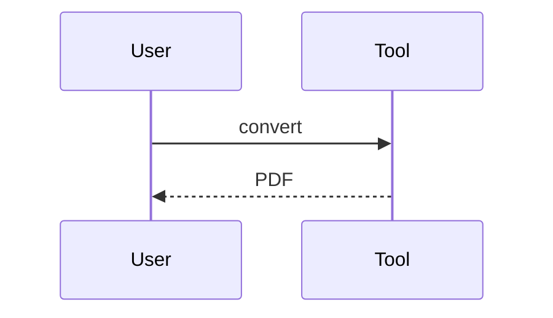

# Sample document

Exercises everything the renderer is expected to handle: GFM, CJK text,
mermaid diagrams and LaTeX. Currency is here on purpose — `$5 / month` and
`$99 / year` must stay literal text, not be swallowed as inline maths.

中文測試：這段文字用來確認中日韓字型可以正常渲染。

## Flowchart

## Sequence

## Formula

$$a^2 + b^2 = c^2$$

## Table and list

| Item | Status |
| :--- | :--- |
| Diagrams | ok |
| Formulas | ok |

- [x] done
- [ ] pending
