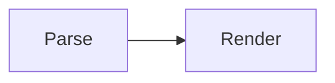

# A document that talks about HTML

The prose below contains a literal closing script tag. Both commands embed the
markdown in a script block, so both have to survive it: the mermaid export
base64-encodes the markdown, and the PDF path escapes the tags on the way in
and unescapes them in the page. A document that merely *discusses* HTML should
render like any other.

To stop a page loading, delete the `<script>` element:

```html
<script src="app.js"></script>
```

The diagram itself is unremarkable:


