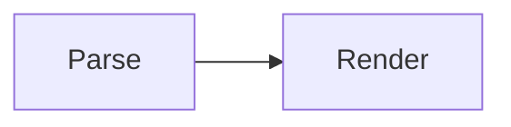

# A document that talks about HTML

The prose below contains a literal closing script tag. The PDF path refuses
such a document outright, because it embeds the markdown raw into a script
block. This command embeds it base64-encoded instead, so a document that merely
*discusses* HTML does not lose its diagrams over it.

To stop a page loading, delete the `<script>` element:

```html
<script src="app.js"></script>
```

The diagram itself is unremarkable:


