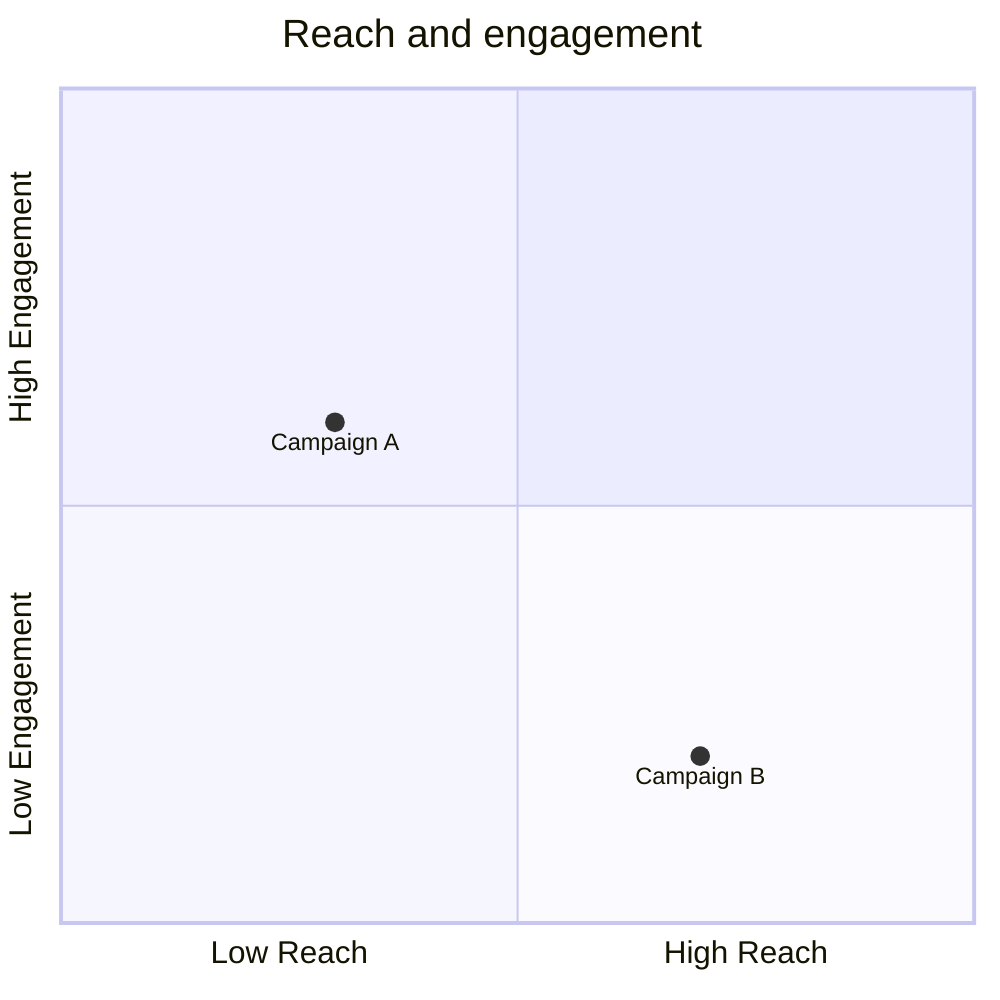
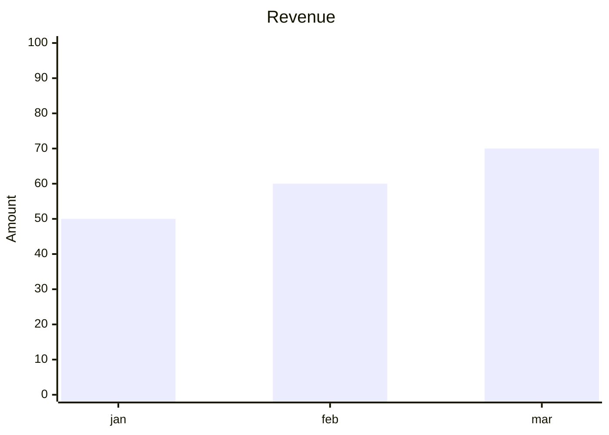

# Diagram types that lie about their size

Both of these ignore `useMaxWidth:false` and emit `width="100%"` with a
`max-width` style and no height at all. In a standalone file "100%" resolves
against nothing: the image reports 150x150 through an `` tag, and as a PNG
its resolution follows whatever the viewport happened to be.

