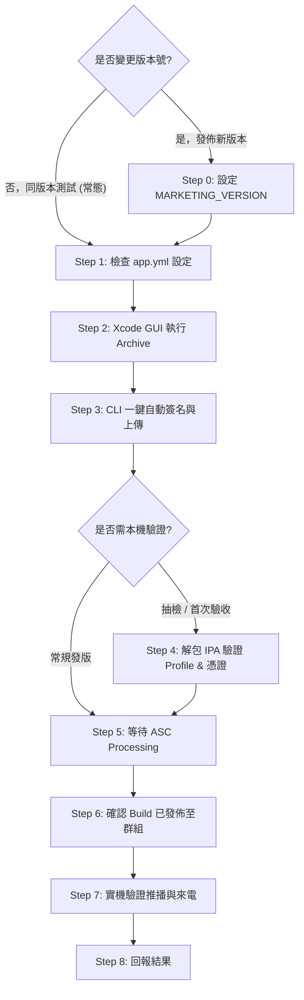

```mermaid
flowchart TB
    Q1{"是否變更版本號?"} -->|"是，發佈新版本"| S0["Step 0: 設定 MARKETING_VERSION"]
    Q1 -->|"否，同版本測試 (常態)"| S1["Step 1: 檢查 app.yml 設定"]
    S0 --> S1
    S1 --> S2["Step 2: Xcode GUI 執行 Archive"]
    S2 --> S3["Step 3: CLI 一鍵自動簽名與上傳"]
    S3 --> Q2{"是否需本機驗證?"}
    Q2 -->|"抽檢 / 首次驗收"| S4["Step 4: 解包 IPA 驗證 Profile & 憑證"]
    Q2 -->|"常規發版"| S5["Step 5: 等待 ASC Processing"]
    S4 --> S5
    S5 --> S6["Step 6: 確認 Build 已發佈至群組"]
    S6 --> S7["Step 7: 實機驗證推播與來電"]
    S7 --> S8["Step 8: 回報結果"]
```
